# terraform-azure-storage-account

Production-ready Terraform module for deploying Azure Storage Accounts with comprehensive support for blob containers, file shares, queues, tables, lifecycle management, network rules, private endpoints, immutability policies, CORS, and static website hosting.

## Architecture

```mermaid
flowchart TD
    A[Azure Storage Account] --> B[Blob Containers]
    A --> C[File Shares]
    A --> D[Queues]
    A --> E[Tables]
    A --> F[Network Rules]
    A --> G[Private Endpoints]
    A --> H[Lifecycle Management]
    A --> I[Diagnostic Settings]
    B --> J[CORS Rules]
    B --> K[Versioning & Change Feed]
    B --> L[Retention Policies]
    A --> M[Static Website]
    A --> N[Immutability Policy]
    G --> O[Private DNS Zones]

    style A fill:#0078D4,stroke:#005A9E,color:#FFFFFF
    style B fill:#50E6FF,stroke:#0078D4,color:#000000
    style C fill:#FFB900,stroke:#FF8C00,color:#000000
    style D fill:#00B7C3,stroke:#008B94,color:#FFFFFF
    style E fill:#7FBA00,stroke:#5E8C00,color:#FFFFFF
    style F fill:#FF6F61,stroke:#D44942,color:#FFFFFF
    style G fill:#00CC6A,stroke:#009E52,color:#FFFFFF
    style H fill:#B4A0FF,stroke:#8661C5,color:#000000
    style I fill:#9B59B6,stroke:#7D3C98,color:#FFFFFF
    style J fill:#FF9F00,stroke:#CC7F00,color:#000000
    style K fill:#50E6FF,stroke:#0078D4,color:#000000
    style L fill:#FF4F4F,stroke:#CC3333,color:#FFFFFF
    style M fill:#FFD700,stroke:#CCB200,color:#000000
    style N fill:#E74856,stroke:#C13239,color:#FFFFFF
    style O fill:#00CC6A,stroke:#009E52,color:#FFFFFF
```



## Features

- Storage Account with configurable tier, replication, kind, and access tier
- Blob containers with access level control and metadata
- File shares with quota, access tier, protocol selection, and ACL support
- Storage queues with metadata
- Storage tables with ACL support
- Blob properties: versioning, change feed, retention policies, and CORS rules
- Lifecycle management policies with tiering and deletion rules
- Static website hosting
- Account-level immutability policies
- Network rules with IP, VNet, and private link access controls
- Private endpoint connectivity with DNS zone groups
- Managed identity support (SystemAssigned and UserAssigned)
- Customer-managed key encryption
- Infrastructure encryption
- Diagnostic settings for blob, file, queue, and table services

## Usage

```hcl
module "storage_account" {
  source = "path/to/terraform-azure-storage-account"

  name                     = "stmyappprod001"
  resource_group_name      = "rg-myapp"
  location                 = "East US"
  account_tier             = "Standard"
  account_replication_type = "GRS"

  containers = {
    "data" = {
      container_access_type = "private"
    }
  }

  tags = {
    Environment = "production"
  }
}
```

## Examples

- [Basic](./examples/basic/) - Simple storage account with containers
- [Advanced](./examples/advanced/) - Blob properties, lifecycle policies, file shares, queues, and tables
- [Complete](./examples/complete/) - Full production setup with private endpoints, network rules, and diagnostics

## Requirements

| Name | Version |
|------|---------|
| terraform | >= 1.3.0 |
| azurerm | >= 3.80.0 |

## Inputs

| Name | Description | Type | Default | Required |
|------|-------------|------|---------|----------|
| name | Storage account name | `string` | n/a | yes |
| resource_group_name | Resource group name | `string` | n/a | yes |
| location | Azure region | `string` | n/a | yes |
| account_tier | Account tier (Standard/Premium) | `string` | `"Standard"` | no |
| account_replication_type | Replication type | `string` | `"LRS"` | no |
| containers | Map of blob containers | `map(object)` | `{}` | no |
| file_shares | Map of file shares | `map(object)` | `{}` | no |
| queues | Map of queues | `map(object)` | `{}` | no |
| tables | Map of tables | `map(object)` | `{}` | no |
| blob_properties | Blob service properties | `object` | `null` | no |
| management_policies | Lifecycle management rules | `list(object)` | `[]` | no |
| network_rules | Network rules config | `object` | `null` | no |
| private_endpoints | Private endpoints | `map(object)` | `{}` | no |
| tags | Tags to assign | `map(string)` | `{}` | no |

## Outputs

| Name | Description |
|------|-------------|
| id | The ID of the storage account |
| name | The name of the storage account |
| primary_blob_endpoint | Primary blob endpoint |
| primary_file_endpoint | Primary file endpoint |
| primary_access_key | Primary access key (sensitive) |
| primary_connection_string | Primary connection string (sensitive) |
| container_ids | Map of container names to IDs |
| file_share_ids | Map of file share names to IDs |
| private_endpoint_ids | Map of private endpoint names to IDs |

## License

MIT License - see [LICENSE](./LICENSE) for details.
